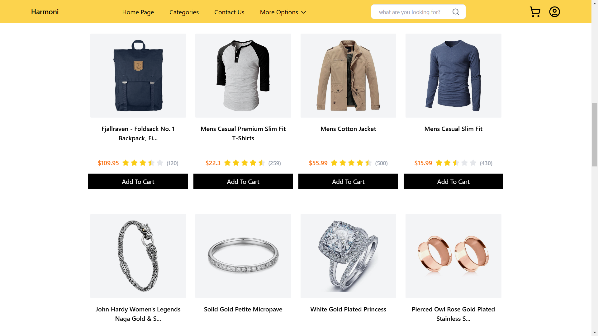
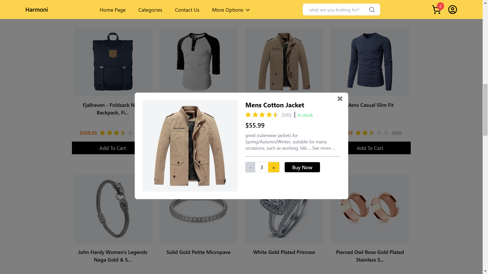

<div align="center">
  <br />
      
      
  <br />
</div>

## ⚙️ Tech Stack

- Vite
- React.js
- tailwind css
- lucide react

## 🤸 Quick Start :-

Follow these steps to set up the project locally on your machine.

**Prerequisites**

Make sure you have the following installed on your machine:

- [Git](https://git-scm.com/)
- [npm](https://www.npmjs.com/) (Node Package Manager)

**Cloning the Repository**

Open command prompt -> type 'cd desktop' ->

```bash
git clone https://github.com/Rukhsarkh/React-e-commerce.git
```

close command prompt -> open the created folder in code editor AND run just 2 commands :-

## installation

install the project dependencies using npm

```bash
npm install
```

## Running

Running the project

```bash
npm run dev
```

Voila ! have a look into your browser !

### Design Decisions

- Nothing special, can do that if i get more time, you can check my frontend projects, i have designed them all by myself

### Notable Features

- truncated title and product description
- implementation of StarRatingIcon component, included float values even
- displaying only the image on gray background excluding the white background of image using mix-blend-multiply
- used pseudo elements to (grayish) encircle the services icons
- maintainable and modular code
- responsivness across mobile, tablet/laptop, desktop
- error handling, conditional renderings
- shows "category not found" on searching unavailable category
- semantic html, accessiblity considerations, React Hooks for state management
- tried to make everything look like the sample designs

### Areas where i struggled

- it was a simple project, struggled nowhere

### if given more time i would :

- i would implment state management using Redux
- structure the css into user defined class for modularity
