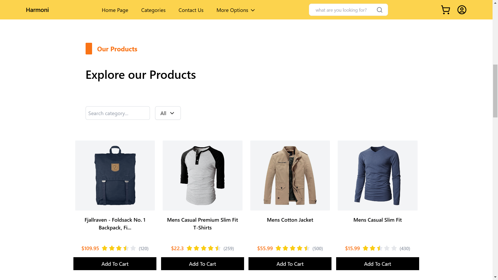

<div align="center">
  <br />
      
  <br />
</div>

## ⚙️ Tech Stack

- Vite
- React.js
- tailwind css
- lucide react

## 🚨 About Repo :-

This repository contains the code for how to use and implement three.js models into our code. I have created three different folders with Each folder containig code for - importing Three.js models through CDN links, using three.js in [ npm + vite ] project and using three.js in [ npm + vite + React ] project. Follow to Following Quick Start guide to run this code on your local machine to see how it works.

## 🤸 Quick Start :-

Follow these steps to set up the project locally on your machine.

**Prerequisites**

Make sure you have the following installed on your machine:

- [Git](https://git-scm.com/)
- [npm](https://www.npmjs.com/) (Node Package Manager)

**Cloning the Repository**

Open command prompt -> type 'cd desktop' ->

```bash
git clone https://github.com/Rukhsarkh/React-e-commerce.git
```

close command prompt -> open the created folder in code editor AND run just 2 commands :-

## installation

install the project dependencies using npm

```bash
npm install
```

## Running

Running the project

```bash
npm run dev
```

Voila ! have a look into your browser !
